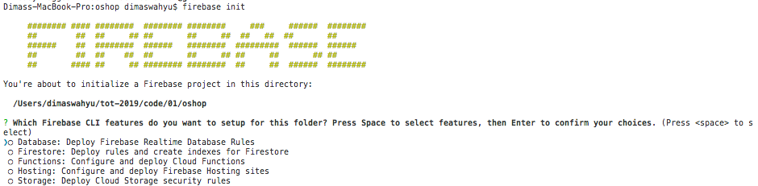
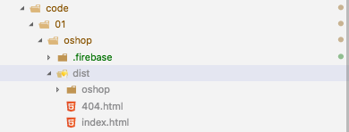
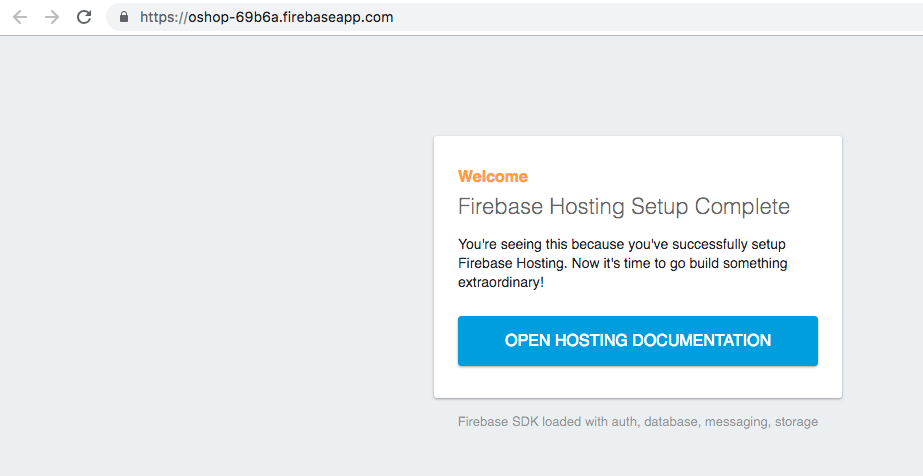
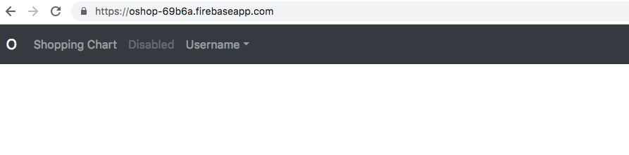

# Kemampuan Akhir Yang Direncanakan

- Peserta mampu Develop dengan firebase

# Percobaan 7 
- install firebase tools dengan cara

```
npm install -g firebase-tools 
```
atau

```
sudo npm install -g firebase-tools 
```
- untuk mengecek version firebase

```
firebase --version
```

 - login menggunakan firebase ketik code berikut

 ```
 firebase login
 ```
 - akan muncul keterangan **? Allow Firebase to collect anonymous CLI usage and error reporting information?** pilih **yes**, nanti anda akan diarahkan ke account gmail anda

 - jika berhasil maka pada saat anda ketik **firebase login** maka akan muncul **Already logged in as akunanda@gmail.com**  **cat:jika anda ingin logout -> ketik firebase logout**

 - tambahkan code berikut **ket:oshop2-73960 ini adalah id project anda di firebase**

```
firebase use -- oshop2-73960
```

 - selanjutnya ketik code berikut 
 
 ```
 firebase init
 ```
 - jika berhasil maka akan muncul seperti pada gambar dibawah ini



- pilih hosting
- What do you want to use as your public directory? (public) dist
- ? Configure as a single-page app (rewrite all urls to /index.html)? (y/N) yes


- buka firebase.json tambahkan code berikut

```
{
  "hosting": {
     "public": "dist/oshop"
  }
}


```
- setelah itu ketik code ini pada terminal

```
ng build --prod
```

- jika berhasil maka akan muncul folder baru dist seperti pada gambar dibawah ini



- setelah itu deploy firebase **ketik diterminal**

```
firebase deploy
```
- jika proses deploy berhasil maka akan muncul hosting url seperti pada gambar berikut


-tambahkan / pada url agar dapat menuju ke halaman web kita

