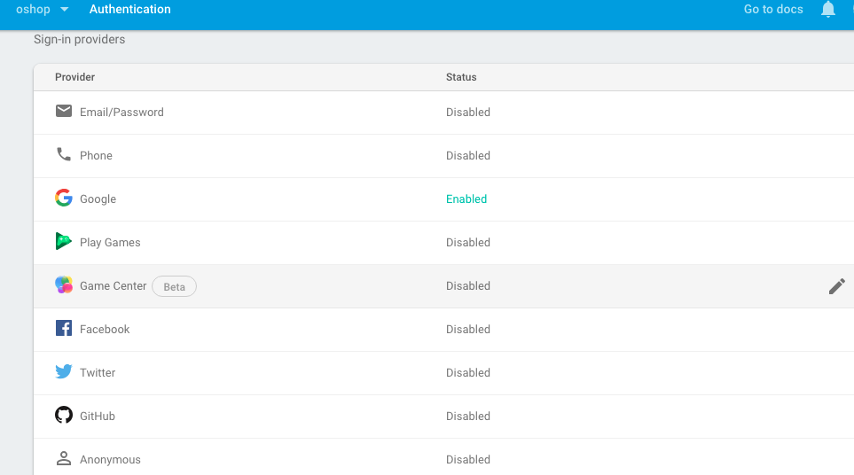
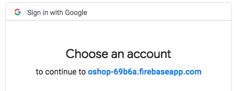

# Kemampuan Akhir Yang Direncanakan

- Peserta mampu menerapkan auth dengan menggunakan google login

# Percobaan 8 Auth With Google Login
- Langkah pertama konfigurasi auth pada firebase
- buka halaman firebase **https://console.firebase.google.com/project/(nama-project-anda/authentication/providers**
- enable sign-in providers **google** seperti pada gambar dibawah ini 

- tambahkan menu login pada **bs-navbar.component.html** untuk codenya sbb:

```
  <li class="nav-item">
        <!-- 2.tambahkan routerlink -->
        <a class="nav-link" routerLink="/shopping-chart">Shopping Chart</a>
      </li>
      <li class="nav-item">
        <a class="nav-link" routerLink="/login">Login</a>
      </li>

```
- sehingga hasilnya seperti pada gambar ini


- tambahkan code berikut pada **login.component.html** kita menambahkan **function login()**

```
<button 
(click)="login()"
class="btn btn-primary">Login With Goolge</button>

```
- sehingga tampilannya seperti pada gambar ini


- buka halaman **login.component.ts** tambahkan beberapa code antara lain
-- import * as firebase from 'firebase'
-- constructor
-- function login
- sehingga code keseluruhan pada **login.component.ts** sebagai berikut

```
import { Component } from '@angular/core';
import * as firebase from 'firebase';
import { AngularFireAuth} from 'angularfire2/auth';

@Component({
  selector: 'app-login',
  templateUrl: './login.component.html',
  styleUrls: ['./login.component.css']
})
export class LoginComponent {

  constructor(private afAuth:AngularFireAuth) { }

  login(){
    this.afAuth.auth.signInWithRedirect(new firebase.auth.GoogleAuthProvider());
  }

}

```
- jika berhasil saat menekan tombol **login with google** maka aplikasi akan mengarahkan ke google account **masuk dengan email yang lain**



- untuk mengecek user yang masuk melalui web dengan menggunakan login with google,kita dapat cek pada authentication users seperti pada gambar

