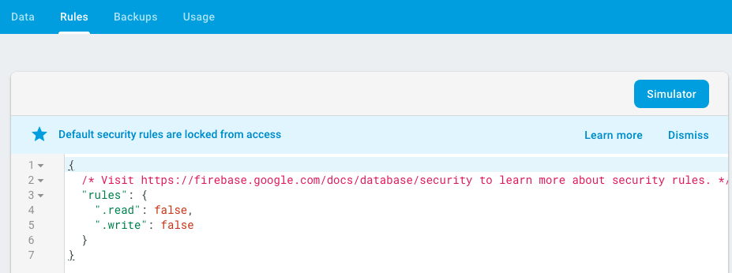
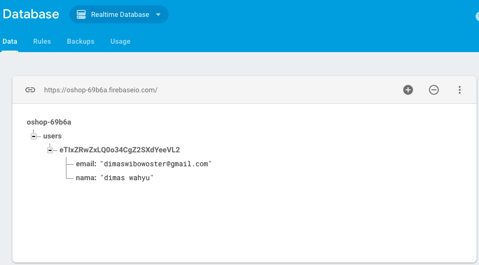

# Kemampuan Akhir Yang Direncanakan

- Peserta cara menggunakan database pada firebase
- Peserta mengetahui cara menyimpan informasi user pada database firebase

# Percobaan 15 Storing Users di Firebase
- buka database pada firebase **https://console.firebase.google.com/project/nama-project/database** sehingga tampilan awal seperti pada gambar ini 


- buatlah database 


- pilih realtimedatabase


- set rulesnya dari false menjadi true 



- pada awal database maka tidak terlihat data apapun **null**


- Generate sebuah servis dengan nama user 

```
ng g s user
```

- buka file **app.module.ts** tambahkan **userService** berikut pada **providers**

```
UserService
```

- sehingga isi array pada **providers** secara kesuluruhan seperti berikut

```
providers: [
    AuthService,
    AuthGuard,
    UserService
  ],
```
- buka file **user.servive.ts** tambahkan code berikut

```
import { Injectable } from '@angular/core';
import * as firebase from 'firebase';
import { AngularFireDatabase } from 'angularfire2/database';


@Injectable({
  providedIn: 'root'
})
export class UserService {

  constructor(private db:AngularFireDatabase) { }

  save(user:firebase.User){
    this.db.object('/users/' + user.uid).update({
      nama: user.displayName,
      email:user.email
    });
  }
}

```
- buka file **app.component.ts** tambahkan code berikut

```
import { Component } from '@angular/core';
import { AuthService } from './auth.service';
import { Router } from '@angular/router';
import { UserService} from './user.service';

@Component({
  selector: 'app-root',
  templateUrl: './app.component.html',
  styleUrls: ['./app.component.css']
})
export class AppComponent {
  // tambahkan paramter userservice
  constructor(private userService:UserService,private auth:AuthService,router:Router){
    auth.user$.subscribe(user=>{
      if(user){
        //tambahkan paramater userservice dengan method save
        userService.save(user);
        let returnUrl = localStorage.getItem('returnUrl');
        router.navigateByUrl(returnUrl);
      }
    })
  }
}

```
- untuk mengecek keberhasilan sistem, anda dapat login dan lihat pada database anda. Jika benar maka akan muncul data seperti pada gambar berikut


