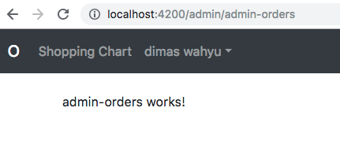

# Kemampuan Akhir Yang Direncanakan

- Peserta mampu membuat service guard untuk admin

# Percobaan 16 membuat service guard untuk admin

- tambahkan child baru seperti pada gambar


- jika berhasil maka tampilannya akan seperti berikut 


- generate servis baru untuk admin

```
ng g s admin-auth-guard
```

- buka file **app.module.ts** tambahkan pada providers **AdminAuthGuardService rename menjadi AdminAuthGuard**

```
  providers: [
    AuthService,
    AuthGuard,
    UserService,
    AdminAuthGuard
  ],
```
- buka file **admin-auth-guard.service.ts** dan tambahkan code berikut

```
import { Injectable } from '@angular/core';
import { CanActivate } from '@angular/router';
import { AuthService } from './auth.service';
import { AppUser } from './models/app-user';
import { map, switchMap} from 'rxjs/operators';
import {UserService} from './user.service';
import {Observable} from 'rxjs';

@Injectable({
  providedIn: 'root'
})
export class AdminAuthGuard implements CanActivate{

  constructor(private auth:AuthService,private userService:UserService) {}

  canActivate():Observable<boolean>{
    return this.auth.user$.pipe(
      switchMap(user=> this.userService.get(user.uid)),
      map((appUser:AppUser)=>appUser.isAdmin)
    )
  }
}


```

- buka file **user.services.ts** dan tambahkan code berikut:

```
import { Injectable } from '@angular/core';
import * as firebase from 'firebase';
import { AngularFireDatabase } from 'angularfire2/database';


@Injectable({
  providedIn: 'root'
})
export class UserService {

  constructor(private db:AngularFireDatabase) { }

  save(user:firebase.User){
    this.db.object('/users/' + user.uid).update({
      nama: user.displayName,
      email:user.email
    });
  }

  // tambahkan get method
  get(uid:string){
    return this.db.object('/users/'+uid).valueChanges();
  }
}

```

- buatlah satu folder dengan nama **models** di **oshop/app**dan buatlah file dengan nama **app-user.ts** didalam folder tersebut
- buka file **app-user.ts** tambahkan code berikut:

```
export interface AppUser{
    name:string;
    email:string;
    isAdmin:boolean;
}
```
- buka file **app.module.ts** tambahkan code **AdminAuthGuard** pada **path admin/admin-products dan admin/admin-orders** seperti code dibawah ini

```
RouterModule.forRoot(
      [
        {path:'',component:HomeComponent},
        {path:'products',component:ProductsComponent},
        {path:'shopping-chart',component:ShoppingChartComponent},
        {path:'check-out',component:CheckOutComponent, canActivate:[AuthGuard]},
        {path:'order-success',component:OrderSuccessComponent,canActivate:[AuthGuard]},
        {path:'orders',component:MyOrdersComponent,canActivate:[AuthGuard]},
        {path:'login',component:LoginComponent},
        {path:'admin/admin-products',
              component:AdminProductsComponent,
              canActivate:[AuthGuard,AdminAuthGuard]},
        {path:'admin/admin-orders',
              component:AdminOrdersComponent,
              canActivate:[AuthGuard,AdminAuthGuard]},        
      ]
    )
```
- untuk mengecek keberhasilan sistem pilih menu **manage order**.Karena posisi awal **isAdmin true** maka kita akan berhasil masuk ke halaman **admin-oreder works** seperti pada gambar berikut



- kita coba ganti isAdminnya menjadi false seperti pada gambar


- kita coba pilih menu **manage order** dan refresh maka lihat hasilnya kita tidak dapat mengakses kembali menu  **manage order**