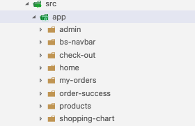

# Kemampuan Akhir Yang Direncanakan

- Peserta mampu membuat routes

# Percobaan 4 Membuat routes

## Membuat Beberapa Component baru
- untuk membuat routes terlebih dahulu buatlah component baru yaitu : home, products, shopping-chart, check-out,order-success, my-orders, admin-products, login
- untuk membuat component **home** code sebagai berikut :
```
ng g c home
```
- untuk membuat component **products** code sebagai berikut :
```
ng g c products
```
- untuk membuat component **shopping-chart** code sebagai berikut :
```
ng g c shopping-chart
```
- untuk membuat component **check-out** code sebagai berikut :
```
ng g c check-out
```
- untuk membuat component **order-success** code sebagai berikut :
```
ng g c order-success
```
- untuk membuat component **my-orders** code sebagai berikut :
```
ng g c my-orders
```
- untuk membuat component **login** code sebagai berikut :
```
ng g c login
```
- selanjutnya membuat sebuah component **admin-products** dalam folder admin code sebagai berikut:
```
ng g c admin/admin-products
```
- selanjutnya membuat sebuah component **admin-orders** dalam folder admin code sebagai berikut:
```
ng g c admin/admin-orders
```
- jika berhasil maka pada **src/app** akan muncul beberapa folder/component yang telah kita generate


- setelah berhasil membuat component baru maka untuk selanjutnya buka **app.module.ts** dan cek apakah semua component yang telah digenerate ada pada **app.module.ts**

- sehingga code pada **app.module.ts** **(oshop/src/app.module.ts)** seperti berikut :

```
import { BrowserModule } from '@angular/platform-browser';
import { NgModule } from '@angular/core';

import { AppComponent } from './app.component';
import { BsNavbarComponent } from './bs-navbar/bs-navbar.component';
import { HomeComponent } from './home/home.component';
import { ProductsComponent } from './products/products.component';
import { ShoppingChartComponent } from './shopping-chart/shopping-chart.component';
import { CheckOutComponent } from './check-out/check-out.component';
import { OrderSuccessComponent } from './order-success/order-success.component';
import { MyOrdersComponent } from './my-orders/my-orders.component';
import { AdminProductsComponent } from './admin/admin-products/admin-products.component';
import { AdminOrdersComponent } from './admin/admin-orders/admin-orders.component';

@NgModule({
  declarations: [
    AppComponent,
    BsNavbarComponent,
    HomeComponent,
    ProductsComponent,
    ShoppingChartComponent,
    CheckOutComponent,
    OrderSuccessComponent,
    MyOrdersComponent,
    AdminProductsComponent,
    AdminOrdersComponent
  ],
  imports: [
    BrowserModule
  ],
  providers: [],
  bootstrap: [AppComponent]
})
export class AppModule { }

```
## RouterModule

- setelah semua component terimport pada  **app.module.ts** maka selanjutnya kita import route
- tambahkan code berikut pada **app.module.ts**
```
import { RouterModule} from '@angular/router';
```
- tambahkan juga code berikut pada  **imports :** **(masih di app.module.ts)**

```
 RouterModule.forRoot(
      [
        {path:'',component:HomeComponent},
        {path:'products',component:ProductsComponent},
        {path:'shopping-chart',component:ShoppingChartComponent},
        {path:'check-out',component:CheckOutComponent},
        {path:'order-success',component:OrderSuccessComponent},
        {path:'login',component:LoginComponent},
        {path:'admin/admin-products',component:AdminProductsComponent},
        {path:'admin/admin-orders',component:AdminOrdersComponent},
        
      ]
    )

```
- sehingga keseluruhan code pada **app.module.ts** seperti berikut :

```
import { BrowserModule } from '@angular/platform-browser';
import { NgModule } from '@angular/core';
import { AngularFireModule } from 'angularfire2';
import { AngularFireDatabaseModule } from 'angularfire2/database';
import { AngularFireAuthModule } from 'angularfire2/auth';
import { environment } from 'src/environments/environment';
import { RouterModule} from '@angular/router';

import { AppComponent } from './app.component';
import { BsNavbarComponent } from './bs-navbar/bs-navbar.component';
import { HomeComponent } from './home/home.component';
import { ProductsComponent } from './products/products.component';
import { ShoppingChartComponent } from './shopping-chart/shopping-chart.component';
import { CheckOutComponent } from './check-out/check-out.component';
import { OrderSuccessComponent } from './order-success/order-success.component';
import { MyOrdersComponent } from './my-orders/my-orders.component';
import { AdminProductsComponent } from './admin/admin-products/admin-products.component';
import { AdminOrdersComponent } from './admin/admin-orders/admin-orders.component';
import { LoginComponent } from './login/login.component';

@NgModule({
  declarations: [
    AppComponent,
    BsNavbarComponent,
    HomeComponent,
    ProductsComponent,
    ShoppingChartComponent,
    CheckOutComponent,
    OrderSuccessComponent,
    MyOrdersComponent,
    AdminProductsComponent,
    AdminOrdersComponent,
    LoginComponent
  ],
  imports: [
    BrowserModule,
    AngularFireModule.initializeApp(environment.firebase),
    AngularFireDatabaseModule,
    AngularFireAuthModule,
    RouterModule.forRoot(
      [
        {path:'',component:HomeComponent},
        {path:'products',component:ProductsComponent},
        {path:'shopping-chart',component:ShoppingChartComponent},
        {path:'check-out',component:CheckOutComponent},
        {path:'order-success',component:OrderSuccessComponent},
        {path:'login',component:LoginComponent},
        {path:'admin/admin-products',component:AdminProductsComponent},
        {path:'admin/admin-orders',component:AdminOrdersComponent},
        
      ]
    )
  ],
  providers: [],
  bootstrap: [AppComponent]
})
export class AppModule { }

```

- langkah berikutnya tambahkan code berikut pada **app.component.html**

```
<bs-navbar></bs-navbar>
<div class="container">
  
<!-- tambahkan code berikut -->
 <router-outlet></router-outlet>

</div><!-- /.container -->

```
- langkah berikutnya tambahkan **routerLink** pada navbar **bs-navbar.component.html** code sebagai berikut

```
<nav class="navbar navbar-expand-md navbar-dark bg-dark fixed-top">
  <a class="navbar-brand" href="#">Navbar</a>
  <button class="navbar-toggler" type="button" data-toggle="collapse" data-target="#navbarsExampleDefault" aria-controls="navbarsExampleDefault" aria-expanded="false" aria-label="Toggle navigation">
    <span class="navbar-toggler-icon"></span>
  </button>

  <div class="collapse navbar-collapse" id="navbarsExampleDefault">
    <ul class="navbar-nav mr-auto">
      <li class="nav-item active">
         <!-- 1.tambahkan routerLink -->
        <a class="nav-link" routerLink="/">Home <span class="sr-only">(current)</span></a>
      </li>
      <li class="nav-item">
        <!-- 2.tambahkan routerlink -->
        <a class="nav-link" routerLink="shopping-chart">Shopping Chart</a>
      </li>
      <li class="nav-item">
        <a class="nav-link disabled" href="#">Disabled</a>
      </li>
      <li class="nav-item dropdown">
        <a class="nav-link dropdown-toggle" href="#" id="dropdown01" data-toggle="dropdown" aria-haspopup="true" aria-expanded="false">Dropdown</a>
        <div class="dropdown-menu" aria-labelledby="dropdown01">
          <a class="dropdown-item" href="#">Action</a>
          <a class="dropdown-item" href="#">Another action</a>
          <a class="dropdown-item" href="#">Something else here</a>
        </div>
      </li>
    </ul>
    <form class="form-inline my-2 my-lg-0">
      <input class="form-control mr-sm-2" type="text" placeholder="Search" aria-label="Search">
      <button class="btn btn-secondary my-2 my-sm-0" type="submit">Search</button>
    </form>
  </div>
</nav>

```
- jika berhasil maka saat diklik pada menu shopping-chart maka akan muncul  **shopping-chart works** begitu juga saat menu home di klik maka akan muncul **home work**
