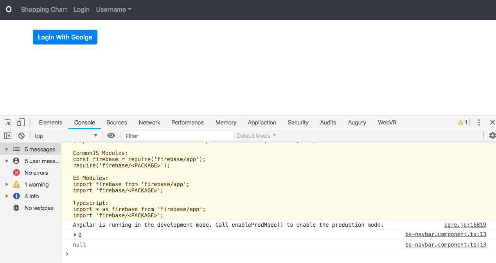

# Kemampuan Akhir Yang Direncanakan

- Peserta mampu membuat proses logout

# Percobaan 9 Logout
- buka halaman **bs-navbar.component.html** tambahkan function click pada logout, code sbb

```
 <a class="dropdown-item" (click)="logout()"> Log Out</a>
 ```
 - buka halaman **bs-navbar.component.ts** buat function click pada **bs-navbar.component.ts** , code sbb

```
import { Component } from '@angular/core';
import { AngularFireAuth} from 'angularfire2/auth';

@Component({
  selector: 'bs-navbar',
  templateUrl: './bs-navbar.component.html',
  styleUrls: ['./bs-navbar.component.css']
})
export class BsNavbarComponent {

  constructor(private afAuth:AngularFireAuth) { }

  logout(){
    this.afAuth.auth.signOut();
  }
}

 ```

 - jika kita logout maka tidak ada perubahan, untuk mengetahui perubahan pada saat di logout maka tambahkan code berikut pada **constructor(private afAuth:AngularFireAuth)**

```
afAuth.authState.subscribe(x=>console.log(x));
```
 - sehingga hasil keseluruhan codenya sebagai berikut

```
import { Component } from '@angular/core';
import { AngularFireAuth} from 'angularfire2/auth';

@Component({
  selector: 'bs-navbar',
  templateUrl: './bs-navbar.component.html',
  styleUrls: ['./bs-navbar.component.css']
})
export class BsNavbarComponent {

  constructor(private afAuth:AngularFireAuth) {
    
    afAuth.authState.subscribe(x=>console.log(x));
   }
  logout(){
    this.afAuth.auth.signOut();
  }
}
```
 - langkah berikutnya **inspect element** pilih console **terlebih dahulu login with google**

 - pada saat kondisi user masih belum logout seperti pada gambar berikut **terdapat beberapa informasi**


- pada saat kondisi user masih sudah logout seperti pada gambar berikut **null**


