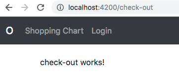

# Kemampuan Akhir Yang Direncanakan

- Peserta mampu membuat auth-guard
- https://angular.io/api/router/CanActivate#description

# Percobaan 13 membuat CanActive 
- sejauh ini kita belum memberikan auth-guard untuk halaman apa saja.Sehingga user dapat mengakses halaman apa saja seperti contoh ketik alamat  **localhost:4200/check-out** maka web akan menampilkan halaman check out seperti pada gambar berikut:



- untuk itu kita membutuhkan auth-guard 
- langkah pertama yang harus dilakukan **menggenerate service** pada **terminal**

```
ng g s auth-guard
```
- buka file **auth-guard.service.ts** dan rename nama classnya menjadi **AuthGuard** seperti pada code berikut:

```
import { Injectable } from '@angular/core';

@Injectable({
  providedIn: 'root'
})
export class AuthGuard {

  constructor() { }
}

```
- tambahkan pada **providers** pada **app.module.ts** **cat:pastikan ada import { AuthGuard } from './auth-guard.service';**

```
  providers: [
    AuthService,
    AuthGuard
  ],
```

- buka file **auth-guard.service.ts** tambahkan beberapa code sehingga seperti dibawah ini 

```
import { Observable} from 'rxjs';
import { AuthService } from './auth.service';
import { Injectable } from '@angular/core';
import { Router, RouterStateSnapshot,ActivatedRouteSnapshot,CanActivate} from '@angular/router';
import { map } from 'rxjs/operators';

@Injectable({
  providedIn: 'root'
})

// @Injectable()
export class AuthGuard implements CanActivate{

  
  constructor(private auth:AuthService,private router:Router) { }

    canActivate(): Observable<boolean> | Promise<boolean> | boolean
    {
      return this.auth.user$.pipe(
        map(user =>{
          if (user){
            return true;
          } 
          this.router.navigate(["/login"]);
          return false;
        })
      );
    }
}
```
- tambahkan **canActive:[AuthGuard]** pada path di **app.module.ts**

```
{path:'check-out',component:CheckOutComponent, canActivate:[AuthGuard]},

```
- sehingga hasil codenya seperti berikut

```
RouterModule.forRoot(
      [
        {path:'',component:HomeComponent},
        {path:'products',component:ProductsComponent},
        {path:'shopping-chart',component:ShoppingChartComponent},
        {path:'check-out',component:CheckOutComponent, canActivate:[AuthGuard]},
        {path:'order-success',component:OrderSuccessComponent,canActivate:[AuthGuard]},
        {path:'orders',component:MyOrdersComponent,canActivate:[AuthGuard]},
        {path:'login',component:LoginComponent},
        {path:'admin/admin-products',component:AdminProductsComponent,canActivate:[AuthGuard]},
        {path:'admin/admin-orders',component:AdminOrdersComponent,canActivate:[AuthGuard]},
        
      ]
    )
```


- jika berhasil maka saat ketik ketik **http://localhost:4200/check-out** maka akan kembali ke halaman login

