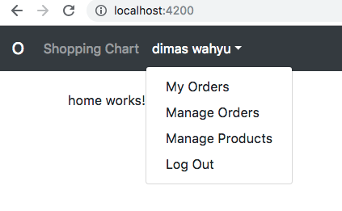

# Kemampuan Akhir Yang Direncanakan

- Peserta mampu mengatur menu-menu untuk admin dan user 

# Percobaan 17 menampilkan dan menyembunyikan link admin 
- langkah pertama  buka file **admin-auth-guard.service.ts** dan modifikasi code seperti berikut

```
import { Injectable } from '@angular/core';
import { CanActivate } from '@angular/router';
import { AuthService } from './auth.service';
import { map} from 'rxjs/operators';
import {UserService} from './user.service';
import {Observable} from 'rxjs';

import { AngularFireDatabase } from 'angularfire2/database';

@Injectable({
  providedIn: 'root'
})
export class AdminAuthGuard implements CanActivate{

  constructor(private auth:AuthService,private userService:UserService,private db:AngularFireDatabase,) {}
  
  canActivate(): Observable<boolean> {
    return this.auth.appUser$
    .pipe(map(AppUser => AppUser.isAdmin));
    }
}

```

- buka file **auth.service.ts** modifikasi codenya menjadi seperti berikut **tambahkan method get Appuser$**

```
import { Injectable } from '@angular/core';
import { AngularFireAuth } from 'angularfire2/auth';
import * as firebase from 'firebase';
import { Observable, of  } from 'rxjs';
import { ActivatedRoute } from '@angular/router';
import { AppUser } from './models/app-user';
import { switchMap} from 'rxjs/operators';
import { UserService } from './user.service';
import { AngularFireDatabase } from 'angularfire2/database';


@Injectable({
  providedIn: 'root'
})
export class AuthService {

  user$:Observable<firebase.User>;
 
  
  //tambahkan parameter ActivedRoute
  constructor(
    private db:AngularFireDatabase,
    private userService:UserService,
    private afAuth:AngularFireAuth, 
    private route :ActivatedRoute) {

    this.user$= afAuth.authState;
   }

   // tambahakan property snapshot pada route dan property queryParamMap
  login(){
    let returnUrl=this.route.snapshot.queryParamMap.get('returnUrl')||'/';
    localStorage.setItem('returnUrl',returnUrl);
    this.afAuth.auth.signInWithRedirect(new firebase.auth.GoogleAuthProvider());
  }

  logout(){
    this.afAuth.auth.signOut();
  }
 
get appUser$() : Observable<AppUser> {
  
    return this.user$.pipe(
    switchMap(user =>
      {
        if (user){
          return this.db.object('/users/'+ user.uid).valueChanges();
        } else{
          return of(null);
        }
      }
     ))
  }
}


```
- buka file **bs-navbar.component.ts** modifikasi code menjadi seperti berikut :

```
<nav class="navbar navbar-expand-md navbar-dark bg-dark fixed-top">
  <a class="navbar-brand" routerLink="/">O</a>
  <button class="navbar-toggler" type="button" data-toggle="collapse" data-target="#navbarsExampleDefault" aria-controls="navbarsExampleDefault" aria-expanded="false" aria-label="Toggle navigation">
    <span class="navbar-toggler-icon"></span>
  </button>

  <div class="collapse navbar-collapse" id="navbarsExampleDefault">
    <ul class="navbar-nav mr-auto">

      <li class="nav-item">
        <!-- 2.tambahkan routerlink -->
        <a class="nav-link" routerLink="/shopping-chart">Shopping Chart</a>
      </li>

      <!-- tambahkan ng template -->
        <ng-template #anonymousUser>
              <li class="nav-item">
              <a class="nav-link" routerLink="/login">Login</a>
            </li>
        </ng-template>
   
      <!-- edit jd appUser$ -->
      <li ngbDropdown *ngIf="appUser; else anonymousUser" class="nav-item dropdown">

        <!-- edit mjd  {{appUser.name}}-->
        <a ngbDropdownToggle class="nav-link dropdown-toggle" id="dropdown01" data-toggle="dropdown" aria-haspopup="true" aria-expanded="false">{{appUser.nama}}</a>
        <div ngbDropdownMenu class="dropdown-menu show" aria-labelledby="dropdown01">

          <!-- rubah code seperti dibawah ini -->
          <a class="dropdown-item" routerLink="orders">My Orders</a>

          <!-- tambahkan ng container -->
          <ng-container *ngIf="appUser.isAdmin">
              <a class="dropdown-item" routerLink="/admin/admin-orders">Manage Orders</a>
              <a class="dropdown-item" routerLink="/admin/admin-products">Manage Products</a>
          </ng-container>
         
          <a class="dropdown-item" (click)="logout()"> Log Out</a>
        </div>
      </li>
    </ul>
  </div>
</nav>


```
- buka file **bs-navbar.module.ts** modifikasi code sehingga seperti berikut

```
import { Component } from '@angular/core';
import { AuthService } from '../auth.service';
import { AppUser } from '../models/app-user';


@Component({
  selector: 'bs-navbar',
  templateUrl: './bs-navbar.component.html',
  styleUrls: ['./bs-navbar.component.css']
})
export class BsNavbarComponent {
  appUser: AppUser;

  constructor(private auth:AuthService) {
    auth.appUser$.subscribe(appUser => this.appUser = appUser);
  }

  logout(){
    this.auth.logout();
  }
}
```
- jalankan **ng serve** jika berhasil maka saat **isAdmin bernilai false** maka tampilannya seperti berikut


- jalankan **ng serve** jika berhasil maka saat **isAdmin bernilai true** maka tampilannya seperti berikut



