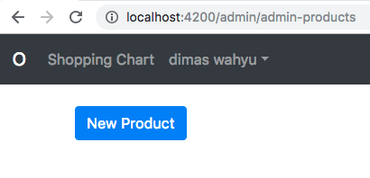

# Kemampuan Akhir Yang Direncanakan

- Peserta mampu membuat form untuk product

# Percobaan 18 membuat form menggunakan bootstrap
- langkah pertama  kita generate **product-form**

```
ng g c admin/product-form
```
- buka file **admin-products.component.html** tambahkan code berikut 

```
<a routerLink="/admin/admin-products/new" class="btn btn-primary"> New Product</a>

```
- buka file **app.module.ts** tambahkan path baru seperti berikut 

```
{path:'admin/admin-products/new',
  component:ProductFormComponent,
  canActivate:[AuthGuard,AdminAuthGuard]},
```
- sehingga keseluruhan code menjadi

```
 RouterModule.forRoot(
      [
        {path:'',component:HomeComponent},
        {path:'products',component:ProductsComponent},
        {path:'shopping-chart',component:ShoppingChartComponent},
        {path:'check-out',component:CheckOutComponent, canActivate:[AuthGuard]},
        {path:'order-success',component:OrderSuccessComponent,canActivate:[AuthGuard]},
        {path:'orders',component:MyOrdersComponent,canActivate:[AuthGuard]},
        {path:'login',component:LoginComponent},
        {path:'admin/admin-products',
              component:AdminProductsComponent,
              canActivate:[AuthGuard,AdminAuthGuard]},
        {path:'admin/admin-products/new',
              component:ProductFormComponent,
              canActivate:[AuthGuard,AdminAuthGuard]},
        {path:'admin/admin-orders',
              component:AdminOrdersComponent,
              canActivate:[AuthGuard,AdminAuthGuard]},        
      ]
    )
  ```
- jika berhasil maka hasil seperti gambar berikut




- buka file **product-form.component.html** tambahkan code berikut :

```
<form>
  <div class="form-group">
    <label for="title">Title</label>
    <input type="text" id="title" class="form-control">
  </div>

  <div class="form-group">
  <label for="price">Price</label>
  <div class="input-group mb-3">
      <div class="input-group-prepend">
        <span class="input-group-text">$</span>
      </div>
      <input type="text" class="form-control">
    </div>
  </div>
  
  <div class="form-group">
    <label for="category">Category</label>
    <select type="text" id="category" class="form-control">
      <option value=""></option>
    </select>
  </div>

  <div class="form-group">
    <label for="image-url">Image Url</label>
    <input type="text" id="image-url" class="form-control">
  </div>
  <button class="btn btn-primary">Save</button>
</form>


```
- sehingga hasilnya seperti pada gambar berikut

