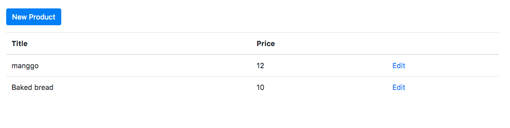

# Kemampuan Akhir Yang Direncanakan

- Peserta mampu menampilkan isi dari product


# Percobaan 24 menampilkan isi dari product

- buka file **product.services.ts** tambahkan method getall

```
import { Injectable } from '@angular/core';
import { AngularFireDatabase } from 'angularfire2/database';

@Injectable({
  providedIn: 'root'
})
export class ProductService {

  constructor(private db:AngularFireDatabase) { }

  create(product){
    return this.db.list('/products').push(product);
  }

  getAll(){
    return this.db.list('/products').snapshotChanges();
  }
}


```

- buka file **admin-products.component.ts**

```
import { Component, OnInit } from '@angular/core';
import { ProductService } from 'src/app/product.service';
import { Observable } from 'rxjs';

@Component({
  selector: 'app-admin-products',
  templateUrl: './admin-products.component.html',
  styleUrls: ['./admin-products.component.css']
})
export class AdminProductsComponent implements OnInit {
  products$:Observable<any[]>;;
    
  constructor(private productService:ProductService) {
    this.products$= this.productService.getAll();
   }

  ngOnInit() {
  }

}

```

- buka file **admin-products.component.html** dan tambahkan code berikut

```
<p>
    <a routerLink="/admin/admin-products/new" class="btn btn-primary"> New Product</a>
</p>
<table class="table">
    <thead>
        <tr>
            <th>Title</th>
            <th>Price</th>
            <th>Image</th>
        </tr>
    </thead>
    <tbody>
        <tr *ngFor="let p of products$ | async">
            <td>{{p.payload.val().title}}</td>
            <td>{{p.payload.val().price}}</td>
            <td>
                <a [routerLink]="['/admin/admin-products',p.key]">Edit</a>
            </td>
        </tr>
    </tbody>
</table>

```

- jika berhasil maka hasilnya akan seperti pada gambar berikut

