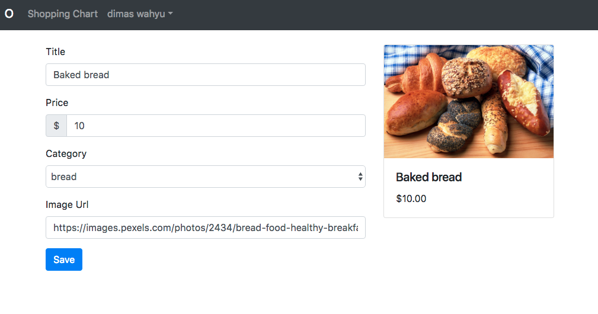

# Kemampuan Akhir Yang Direncanakan

- Peserta mampu mengupdate isi dari product

# Percobaan update

- buka file **product.service.component.ts** tambahkan method update

```
import { Injectable } from '@angular/core';
import { AngularFireDatabase } from 'angularfire2/database';

@Injectable({
  providedIn: 'root'
})
export class ProductService {

  constructor(private db:AngularFireDatabase) { }

  create(product){
    return this.db.list('/products').push(product);
  }

  getAll(){
    return this.db.list('/products').snapshotChanges();
  }

  get(productId){
    return this.db.object('/products/'+productId);
  }

  update(productId,product){
    return this.db.object('/products/'+productId).update(product);
  }
}


```

- buka file **product-form.component.ts** modifikasi codenya menjadi berikut

```
import { Component, OnInit } from '@angular/core';
import { CategoryService } from 'src/app/category.service';
import { ProductService } from 'src/app/product.service';
import { Router, ActivatedRoute } from '@angular/router';

@Component({
  selector: 'app-product-form',
  templateUrl: './product-form.component.html',
  styleUrls: ['./product-form.component.css']
})
export class ProductFormComponent implements OnInit {

  categories$;
  product={};
  id;

  constructor(
    private router:Router,
    private route: ActivatedRoute,
    private categoryService:CategoryService,
    private productService:ProductService) {
    this.categories$=categoryService.getCategories();

    // let id = this.route.snapshot.paramMap.get('id');
    // if (id) {
    //   this.productService.get(id).valueChanges().subscribe(p => this.product = p);

    this.id = this.route.snapshot.paramMap.get('id');
    if (this.id) {
      this.productService.get(this.id).valueChanges().subscribe(p => this.product = p);

    }
   }

   save(product){
    //  console.log(product);
    // this.productService.create(product);
    // this.router.navigate(['/admin/admin-products']);

    if(this.id) this.productService.update(this.id,product);
    else this.productService.create(product);
    this.router.navigate(['/admin/admin-products']);
    
   }

  ngOnInit() {
  }

}

```

- klik edit jika berhasil maka hasilnya akan seperti pada gambar dibawah ini


- jika lihat gambar diatas ada beberapa informasi yang belum tampil seperti title dan price dibawah gambar. Untuk itu lakukan perubahan code seperti code berikut ini pada **file product-form.component.ts**

```
  <div class="card-body">
        <h5 class="card-title">{{ product.title }}</h5>
        <p class="card-text">{{ product.price | currency: "USD":true }}</p>
      </div>

```
- jika benar maka tampilannya akan seperti pada gambar berikut



