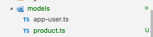
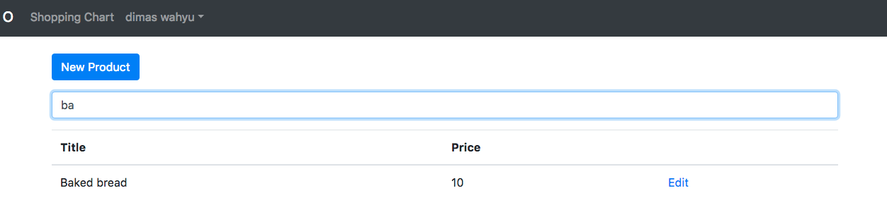

# Kemampuan Akhir Yang Direncanakan

- Peserta mampu membuat interface product
- proses search product dapat dilakukan dengan 2 cara
    - cara pertama dengan mengset inputan property product menggunakan any [] percobaan 29.md
    - cara kedua dengan mengset inputan propert product menggunakan interface percobaan 30.md

# Percobaan interface product

- buatlah sebuah interface baru pada folder models dan beri nama **Product.ts** seperti gambar berikut


- buka file **Product.ts** pada folder model tambahkan code berikut

```
 export interface Product{
     title : string;
     price : number;
     category : string;
     imageUrl:string;
     key:string;
 }

```

- buka file **admin-products.component.ts** modifikasi codenya menjadi seperti berikut

```
import { Component, OnInit, OnDestroy } from '@angular/core';
import { ProductService } from 'src/app/product.service';
import { Observable, Subscription } from 'rxjs';
import { Product } from 'src/app/models/Product';


@Component({
  selector: 'app-admin-products',
  templateUrl: './admin-products.component.html',
  styleUrls: ['./admin-products.component.css']
})
export class AdminProductsComponent implements OnInit, OnDestroy {
  products:Product[];
  filteredProducts:any[];
  subscription:Subscription;
    
  constructor(private productService: ProductService) {
    this.subscription = this.productService.getAll()
      .subscribe(products => {
        this.filteredProducts = this.products = products.map(
          product => {
            return <Product>{
              title: product.payload.val()['title'],
              category: product.payload.val()['category'],
              imageUrl: product.payload.val()['imageUrl'],
              price: product.payload.val()['price'],
              key: product.key
            }
          }
        )
      });
  }

   filter(query: string) {
    this.filteredProducts = (query) ?
      this.products.filter(p => p.title.toLowerCase().includes(query.toLowerCase())) :
      this.products;
  }

  ngOnDestroy(){
    this.subscription.unsubscribe();
  } 
  ngOnInit() {
    
  }

}

```

- buka file **admin-products.component.html** modifikasi codenya menjadi

```
<p>
    <a routerLink="/admin/admin-products/new" class="btn btn-primary"> New Product</a>
</p>
<p>
    <input 
    #query
    (keyup)="filter(query.value)"
    type="text" class="form-control" placeholder="search....">
</p>
<table class="table">
    <thead>
        <tr>
            <th>Title</th>
            <th>Price</th>
            <th></th>
        </tr>
    </thead>
    <tbody>
        <tr *ngFor="let p of filteredProducts">
            <td>{{p.title}}</td>
            <td>{{p.price}}</td>
            <td>
                <a [routerLink]="['/admin/admin-products',p.key]">Edit</a>
            </td>
        </tr>
    </tbody>
</table>
```

- jika benar maka tampilannya akan seperti pada gambar berikut




